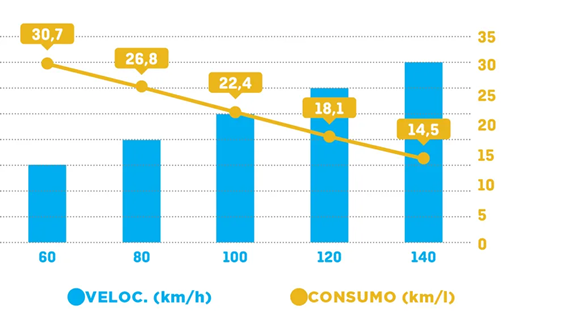

# ProvaUm
## Prova 01
LEIA os textos a seguir:

Como economizar combustível do carro: veja dicas para poupar até R$ 5 mil por ano

O preço do litro da gasolina no Brasil praticamente obriga os motoristas a encontrarem soluções para economizar combustível. No entanto, a tarefa de obter o máximo de desempenho de um carro para garantir que um veículo seja menos beberrão está longe de ser fácil.

É exatamente por esse motivo que a Autoesporte foi até o campo de provas da GM, em Indaiatuba (SP), para tentar responder à uma série de perguntas relacionadas ao consumo de combustível e ao comportamento dos condutores.

Acompanhados por jornalistas e pela engenharia da Chevrolet, testes foram realizados com dois cobaias: o Onix Plus, um dos carros mais econômicos à venda no Brasil, e o Tracker.

Qual é a velocidade mais econômica?

Em um dos testes, os pilotos da GM simularam o consumo rodoviário em velocidades de 60 km/h a 140 km/h, com intervalos de 20 km/h. Para eliminar variáveis, essa avaliação foi feita em um percurso circular que replica uma reta infinita. Isso significa que foi considerada uma velocidade constante e uma pista sem subidas ou descidas.

Assim, foram obtidos dados que evidenciaram que a velocidade mais econômica é também a menor. A 60 km/h, o Chevrolet Onix Plus registrou impressionantes 30,7 km/l. Mas é claro que dirigir em uma condição como essa acaba sacrificando o tempo de viagem.

O Gráfico a seguir, ilustra a relação velocidade/consumo evidenciado.

Gráfico 1: Relação Velocidade/Consumo.

  

Fonte: Texto, dados e gráfico adaptados de  https://autoesporte.globo.com/seu-bolso/noticia/2022/12/como-economizar-combustivel-do-carro-veja-dicas-para-poupar-ate-r-5-mil-por-ano.ghtml

 

Agora, LEIA, atentamente O Contexto a seguir:

 

Você foi convidado a desenvolver uma rotina, que será disponibilizada numa API, com objetivo de ser usada em um site e um app, que calculará uma estimativa de custo de combustível.

Sua missão será receber quantos quilômetros o motorista dirigiu em cada faixa de velocidade 60 KM/H, 80 KM/H, 100 KM/H, 120 KM/H e 140 KM/H, o valor do litro de combustível. E deve apresentar o total de quilômetros rodados, a velocidade média ponderada e o custo estimado da viagem.

 

 

 

A encomenda consiste no seguinte:

Você deverá desenvolver um programa em Java, que solicite ao funcionário:

A placa do veículo;
O valor do litro do combustível;
A quantidade de quilômetros rodados a 60 KM/H;
A quantidade de quilômetros rodados a 80 KM/H;
A quantidade de quilômetros rodados a 100 KM/H;
A quantidade de quilômetros rodados a 120 KM/H;
A quantidade de quilômetros rodados a 140 KM/H.
A seguir, o programa deverá calcular:

A quantidade utilizada de combustível para cada trecho;
A quantidade total de combustível;
A velocidade média ponderada da viagem;
O custo total da viagem.
Por fim, seu programa deverá imprimir:

A placa do veículo;
O custo total da viagem;
A velocidade média ponderada da viagem;
A quantidade total de combustível;
